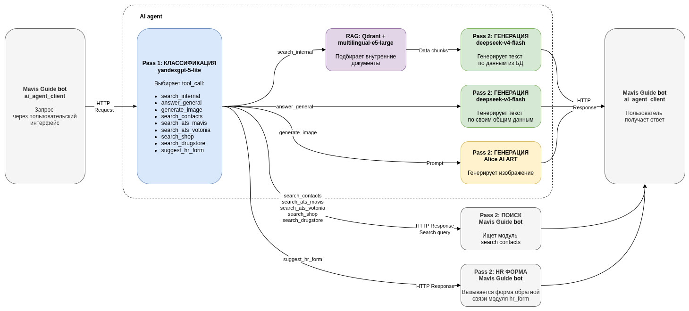

# HR AI Agent

ИИ-агент для HR-бота МАВИС-гид. Отдельный сервис, отвечающий на
открытые вопросы сотрудников по корпоративным данным. Бот обращается к нему
по HTTP.

## Что умеет

На каждый вопрос агент по двухпроходной схеме решает, как ответить. Первый
проход (Pass 1) — классификатор: выбирает инструмент. Второй проход (Pass 2) —
формирует ответ.

- **Поиск во внутренних источниках** (`search_internal`) — ищет по подготовленной
  таблице FAQ, документам (регламенты, бланки) и базе знаний. Ответ
  может быть в любом из них, агент ищет везде одним запросом. Найденный
  контекст передаётся в Pass 2, который формулирует ответ.
- **Команда боту** (`search_contacts`, `search_ats_mavis`, `search_ats_votonia`,
  `search_shop`, `search_drugstore`) — агент не отвечает сам, а возвращает боту
  инструкцию выполнить поиск по справочнику. Для выбора отдела агент подгружает
  списки отделов и кеширует их в Redis на сутки. Для магазинов и аптек топоним
  (улица в приоритете, иначе город) извлекается из кешируемого словаря адресов.
- **Общий ответ** (`answer_general`) — если вопрос не про работу в компании.
- **Изображение** (`generate_image`) — генерирует изображение по тексту через
  Alice AI ART.
- **Форма HR** (`suggest_hr_form`) — если по корпоративному вопросу ничего
  не нашлось, агент предлагает обратиться к живому HR.

Схема обработки запросов:


Все текстовые ответы и вызовы инструментов записываются в таблицу аналитики
(в обезличенном виде) — для последующего анализа. В аналитике фиксируются также
модели и количество токенов по каждому проходу (для контроля расхода).

## Провайдеры LLM

Агент работает с двумя провайдерами, выбор — через `LLM_PROVIDER` в `.env`:

- **Yandex AI Studio** (основной) — Pass 1 на лёгкой модели-классификаторе
  (`yandexgpt-5-lite`), Pass 2 на сильной модели-ответчике (`deepseek-v4-flash`).
  Если лёгкая модель не справилась с классификацией, запрос эскалируется на
  сильную модель.
- **GigaChat** (запасной) — перебирает свои модели Max → Pro → Lite с fallback
  по квоте. Используется как самостоятельный провайдер и как автоматический
  fallback при сбое Yandex.

## Защита персональных данных

Фамилии и имена из запроса маскируются (NAME_1, NAME_2, ...) до отправки во
внешнюю LLM. Реальные имена восстанавливаются только в финальном ответе
пользователю и в аргументах команд для бота. В истории сессий и в
аналитике хранятся только маскированные версии. В логи реальные имена не
пишутся — только маскированные.

Отдельный механизм — **скрытые данные**: чувствительные значения из FAQ
(например, контактный e-mail) не передаются в LLM вовсе. В тексте FAQ стоит
плейсхолдер с решёткой (`#АХО_КОНТАКТ`), а само значение хранится отдельно.
LLM переносит плейсхолдер дословно, а реальное значение подставляется
программно уже после Pass 2 — в ответ пользователю. В историю и аналитику
уходит версия с плейсхолдером.

## Архитектура

- FastAPI-сервис с эндпоинтами `POST /api/v1/ask` + `/api/v1/health`
- Внешняя LLM: Yandex AI Studio (основной) или GigaChat (запасной/fallback)
- RAG: Qdrant + локальная модель multilingual-e5-large
- Источники данных: NocoDB — FAQ и метаданные документов, файлы в CDN
- Контракт бот ↔ агент: `docs/openapi.yaml`

## Стек

Python 3.12, FastAPI, Qdrant, Redis, pymorphy3, sentence-transformers.

## Настройка

Создать `devops/.env` из примера и заполнить значениями (ключи NocoDB,
ключи провайдера LLM — Yandex и/или GigaChat, общий API-ключ, соль, ID таблиц,
`LLM_PROVIDER`):

```commandline
cp devops/.env.example devops/.env
```

## Запуск

Поднять стек (агент + Qdrant + Redis):

```commandline
cd devops
docker compose up -d --build
```

Первый старт занимает несколько минут — скачивается модель эмбеддингов (~2 ГБ).
Проверка готовности:

```commandline
curl http://localhost:8000/api/v1/health
```

Проиндексировать источники данных в Qdrant:

```commandline
docker compose run --rm indexer --faq --documents
```

Индексатор инкрементальный — повторный запуск переиндексирует только
изменённые записи. Записи, удалённые или переименованные в NocoDB, при
переиндексации удаляются и из Qdrant (синхронизация по идентификаторам
источников), поэтому устаревшие ссылки не накапливаются.

## Проверка через Swagger

Откройте `http://localhost:8000/docs`, авторизуйтесь, затем `POST /api/v1/ask`.

## Тесты

При поднятых Qdrant и Redis — все тесты:

```commandline
pytest
```

Без поднятых сервисов часть интеграционных тестов упадёт по причине отсутствия
подключения - это не ошибки кода.

## Структура

```
app/
├── core/           config, logging, security, exceptions
├── api/            FastAPI routes, middleware, error handlers, схемы
├── services/       agent_loop_yandex, agent_loop_gigachat, agent_common,
│                   pii_parser, pii_cache, session_store,
│                   departments_cache, address_cache
├── llm/            BaseLLMClient, YandexClient, GigaChatClient,
│                   YandexArtClient, factory, промпты (yandex/gigachat)
├── tools/          registry, tools_internal (поиск в Qdrant)
├── rag/            qdrant_store, embedder, chunker
├── repositories/   nocodb_client, faq, documents, pivot, analytics
└── indexing/       faq_indexer, documents_indexer, file_readers
scripts/            run_indexers.py
devops/             Dockerfile, docker-compose.yml, .env.example
docs/               openapi.yaml
```